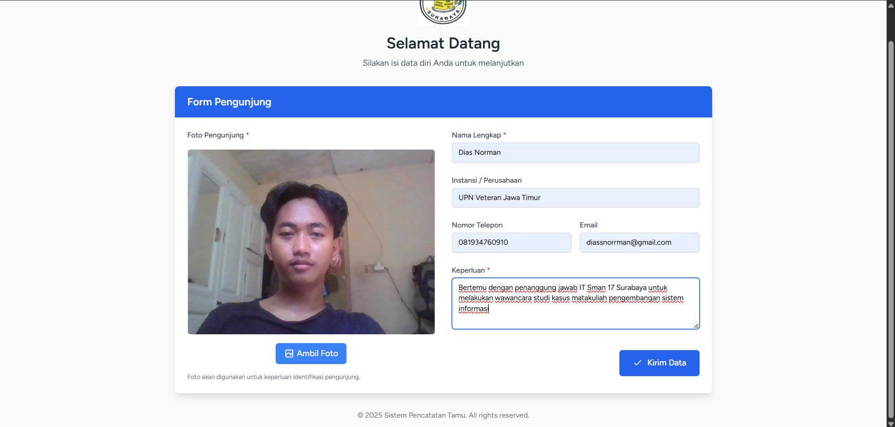
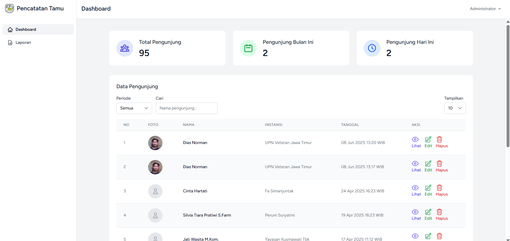
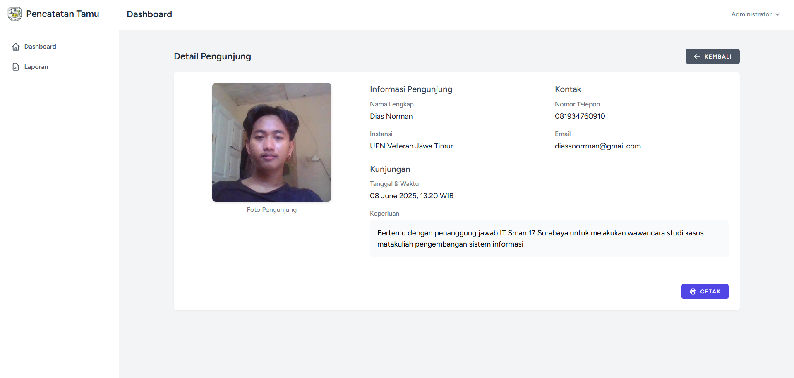
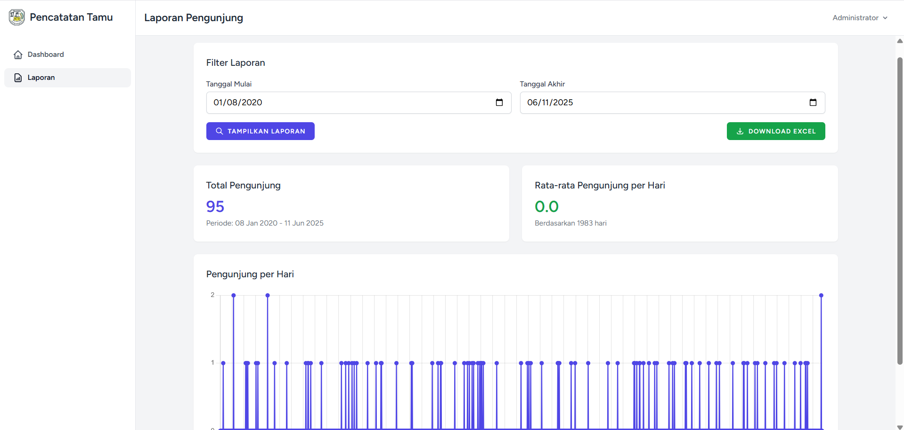

# Pencatatan Tamu (Guest Book System)

A modern web-based guest book system built with Laravel that allows organizations to digitally record and manage visitor information. The system includes features like visitor photo capture, reporting, and a user-friendly dashboard.


## Features

### 1. Digital Guest Registration
- Real-time photo capture using device camera
- Comprehensive visitor information collection:
  - Full Name
  - Institution/Company
  - Phone Number
  - Email
  - Purpose of Visit
- Automatic timestamp recording

### 2. Administrative Dashboard
- Overview statistics:
  - Total visitors
  - Monthly visitors
  - Daily visitors
- Real-time visitor list with search and filter capabilities
- Detailed visitor information view
- Edit and delete visitor records

### 3. Reporting System
- Date range filtering
- Export to Excel functionality
- Visitor statistics visualization
- Average daily visitor calculations


## Technology Stack

- **Framework**: Laravel 12.x
- **Frontend**: 
  - Tailwind CSS
  - Alpine.js
- **Database**: MySQL
- **Additional Libraries**:
  - Excel export functionality
  - Chart.js for statistics visualization

## Installation

1. Clone the repository
```bash
git clone https://github.com/diasoy/guest-book.git
```

2. Install dependencies
```bash
composer install
npm install
```

3. Configure environment
```bash
cp .env.example .env
php artisan key:generate
```

4. Set up database
```bash
php artisan migrate
```

5. Start the development server
```bash
php artisan serve
npm run dev
```

## Usage

### Guest Registration
1. Access the main page
2. Fill in the required information
3. Take a photo using the device camera
4. Submit the form

### Administrative Tasks
1. Log in to the admin dashboard
2. View visitor statistics
3. Manage visitor records
4. Generate and export reports

## Screenshots


### Visitor Form


### Admin Dashboard


### Visitor Details


### Reports Page


## Contributing

Contributions are welcome! Please feel free to submit a Pull Request.

## Acknowledgments

- Laravel Framework
- Tailwind CSS
- All contributors who helped with the project

## Contact

For questions and support, please contact:
- Email: diassnorrman@gmail.com
- GitHub: [@diasoy](https://github.com/diasoy)